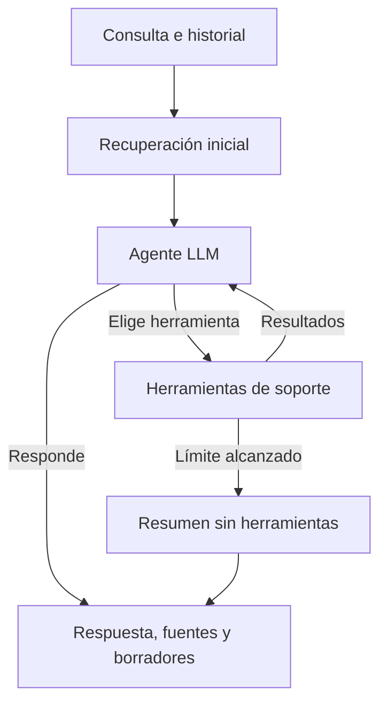

# SupportRAG Agent · Ollama

**Asistencia al diagnóstico de incidencias mediante IA local y documentación técnica.**

Agente local de soporte técnico construido con Python, LangChain y LangGraph. Consulta una base de conocimiento, selecciona herramientas para investigar una incidencia y devuelve una respuesta en español con fuentes, un registro de herramientas utilizadas y, cuando corresponde, un borrador de escalado a N2.

Esta versión es independiente de [SupportRAG Agent con OpenAI](https://github.com/yassmyss/support-rag-agent). Tanto la generación como los embeddings se ejecutan mediante Ollama, local por defecto, sin clave de OpenAI.

## Objetivo y casos de uso

Centraliza la consulta de procedimientos técnicos y facilita la recopilación de información durante el diagnóstico de incidencias. Está orientado a equipos de soporte N1/N2 que necesitan respuestas trazables a una base de conocimiento y borradores estructurados para escalar casos.

La documentación incluida cubre Docker/WSL, conectividad y DNS, PostgreSQL y almacenamiento. La cobertura se amplía incorporando procedimientos de la organización a la base de conocimiento. Los logs aportados y el contexto de la conversación permiten orientar las comprobaciones y preparar un resumen para soporte N2.

El agente decide si necesita buscar más información, leer un procedimiento, analizar patrones en logs o preparar un escalado. La recuperación inicial de documentos es automática; las llamadas posteriores a herramientas las elige el modelo.

## Funcionalidades

- Interfaz web con conversación, entrada de logs y carga de archivos `.txt` o `.log`.
- Búsqueda semántica sobre documentos Markdown con embeddings locales.
- Índice Chroma persistente, reutilizado entre consultas y reinicios.
- Selección de herramientas mediante llamadas del modelo y bucle de LangGraph.
- Análisis de patrones de DNS, conexión, autenticación, memoria, disco y permisos.
- Borradores N2 con resumen, impacto, prioridad orientativa, comprobaciones declaradas y datos pendientes.
- Memoria temporal por conversación y opción de cerrar la sesión.
- Fuentes y registro de herramientas visibles; descarga del último resultado en JSON.
- Comprobación de disponibilidad de Ollama y modelos, validación de entradas y errores explicativos.
- Límites de iteraciones, herramientas, longitud de entradas y número de sesiones.
- Pruebas automatizadas, evaluación manual asistida y configuración de CI para Windows y Linux.

## Tecnología

| Tecnología | Uso |
| --- | --- |
| Python 3.12 | Servidor y herramientas de diagnóstico |
| Ollama / `llama3.2:3b` | LLM local para responder y elegir herramientas |
| Ollama / `nomic-embed-text` | Embeddings de documentos y consultas |
| LangChain y `langchain-ollama` | Mensajes, modelos, esquemas de herramientas e integración |
| LangGraph | Estado, bifurcaciones y bucle agente → herramientas → agente |
| Chroma | Base de datos vectorial persistente y recuperación semántica |
| FastAPI y Pydantic | API REST, validación y documentación OpenAPI |
| HTML, CSS y JavaScript | Interfaz web adaptable a móvil, sin framework |
| Pytest / GitHub Actions | Pruebas y automatización de comprobaciones |
| Docker | Contenedor opcional para la API |

## Arquitectura



| Herramienta | Qué hace |
| --- | --- |
| `search_knowledge` | Busca documentos por significado |
| `read_procedure` | Lee un Markdown permitido de la base de conocimiento |
| `analyze_logs` | Detecta patrones conocidos en el texto aportado |
| `prepare_escalation` | Prepara un borrador N2; no registra ni envía un ticket |

El registro muestra herramientas y su estado, no razonamiento interno del modelo. La categoría inicial se obtiene mediante palabras clave y sirve como orientación. El modelo puede pedir aclaraciones en su respuesta; la persona aporta los datos en el siguiente turno.

## Instalación y puesta en marcha

### 1. Requisitos y modelos locales

- Python 3.12.
- Ollama instalado y accesible desde el servidor de la aplicación.
- Memoria y espacio disponibles para los dos modelos; la latencia debe validarse en el equipo de destino.
- Los comandos siguientes están preparados para Windows / PowerShell.

Instala [Ollama para Windows](https://ollama.com/download/windows), abre la aplicación y ejecuta en una terminal nueva:

```powershell
ollama pull llama3.2:3b
ollama pull nomic-embed-text
ollama list
```

Mantén Ollama abierto. Si no funciona como aplicación, ejecuta `ollama serve` en otra terminal. Si el puerto está ocupado, puede que Ollama ya esté funcionando.

Las descargas iniciales requieren Internet. Con dependencias y modelos descargados, las consultas pueden ejecutarse localmente sin conexión. Utiliza modelos locales, sin variantes cloud. El modelo de conversación debe admitir llamadas a herramientas; el modelo de embeddings debe producir vectores.

### 2. Preparar el proyecto

Clona el repositorio y entra en la carpeta de la aplicación. También puedes descargar el ZIP desde GitHub.

```powershell
git clone https://github.com/yassmyss/support-rag-agent-ollama.git
cd support-rag-agent-ollama
```

Crea un entorno virtual e instala las dependencias:

```powershell
py -3.12 -m venv .venv
.\.venv\Scripts\Activate.ps1
python -m pip install -r requirements.txt
Copy-Item .env.example .env
```

Si Python 3.12 no está instalado, instálalo antes de crear el entorno. Usa un `.venv` propio para esta versión. `.env` es opcional con los valores predeterminados y no necesita claves.

### 3. Arrancar y consultar

```powershell
python -m uvicorn app.main:app --reload
```

Abre **http://localhost:8000**. Pulsa **Comprobar modelos**, escribe la incidencia y, si lo necesitas, aporta un fragmento de logs. La primera consulta puede tardar más al cargar los modelos y preparar el índice.

Ejemplo de recorrido:

1. «Mi contenedor Docker se ha detenido. ¿Qué puedo comprobar?»
2. En el siguiente turno: «Estos son los datos que he recopilado», con `OOMKilled=true, exited code 137` en el campo de logs.
3. «Afecta a varias personas y no tengo permisos para continuar. Prepara un borrador N2.»
4. Revisa respuesta, documentos y herramientas. Descarga el informe JSON si quieres conservar el último resultado.

La secuencia exacta de herramientas depende del modelo. El código 137 por sí solo no confirma falta de memoria. El agente no inspecciona Docker ni el equipo: trabaja con la documentación y los datos que le aportas.

Para detenerlo pulsa `Ctrl+C`. En otra sesión activa `.venv`, abre Ollama y arranca Uvicorn. No hace falta instalar de nuevo las dependencias si no han cambiado.

## Configuración

```dotenv
OLLAMA_BASE_URL=http://localhost:11434
OLLAMA_CHAT_MODEL=llama3.2:3b
OLLAMA_EMBEDDING_MODEL=nomic-embed-text
TOP_K=4
MAX_AGENT_ROUNDS=4
MAX_TOOL_CALLS=10
SESSION_TTL_SECONDS=1800
MAX_SESSIONS=50
```

Reinicia el servidor después de modificar `.env`. Puedes elegir otro modelo local compatible con herramientas, descargándolo primero mediante `ollama pull` y cambiando su nombre.

Por defecto, el agente dispone de cuatro rondas de decisión y hasta diez llamadas a herramientas, además de la recuperación inicial. Al alcanzar un límite, se solicita un resumen sin herramientas. Cada llamada al modelo tiene un tiempo de espera de 180 segundos; una consulta con varias rondas puede tardar varios minutos. El contexto se limita por longitud y el modelo se configura con una ventana de 8192 tokens; las conversaciones extensas se recortan.

## Memoria e índice

La memoria de conversación se guarda **en RAM**, hasta seis turnos recientes y con un límite adicional de longitud. Caduca después de 30 minutos de inactividad por defecto y desaparece al reiniciar el servidor. La interfaz conserva el identificador durante la página abierta; al recargarla se inicia otra conversación. Usa **Nueva conversación** para cerrar la anterior explícitamente.

Los embeddings de documentos se guardan en `.chroma/`. Cambiar documentos, modelo de embeddings o fragmentación genera una colección nueva; no se recalculan los mismos documentos en cada consulta. Las colecciones anteriores se conservan. Si reemplazas un modelo con el mismo nombre o quieres regenerarlo, detén el servidor y elimina `.chroma/`.

Utiliza un único proceso Uvicorn: la memoria de sesiones y los bloqueos son locales al proceso. Para un despliegue con varios procesos harían falta memoria compartida y coordinación del índice.

## API

| Ruta | Uso |
| --- | --- |
| `GET /` | Interfaz web |
| `GET /health` | Estado de la API |
| `GET /ready` | Comprueba conexión y presencia de modelos en Ollama |
| `POST /ask` | Consulta al agente |
| `DELETE /sessions/{session_id}` | Elimina una conversación de la memoria |
| `GET /docs` | Documentación interactiva |

`/ready` comprueba modelos instalados, no su calidad, compatibilidad efectiva con herramientas ni capacidad para completar una generación. Devuelve `ready: false` si falta algún modelo.

Primera consulta:

```json
{
  "question": "Mi contenedor Docker se detiene, analiza estos logs",
  "logs": "OOMKilled=true, exited code 137"
}
```

Para continuar, envía el `session_id` devuelto junto a la siguiente pregunta. Si no lo envías, se crea otra conversación.

La respuesta incluye `category`, `answer`, `sources`, `session_id`, `trace`, `escalations` y `limit_reached`. Preguntas: entre 3 y 2000 caracteres tras recortar espacios; logs: hasta 12 000 caracteres. La prioridad de escalado es una orientación basada en el impacto declarado, no un SLA corporativo.

## Ampliar documentación y herramientas

Añade archivos `.md` a `knowledge_base/` con procedimientos claros y criterios de escalado. Los cambios se detectan en la siguiente consulta. Los enlaces simbólicos se excluyen y la herramienta de lectura acepta únicamente nombres de documentos permitidos.

Para añadir una herramienta, define su esquema Pydantic y función en `app/tools.py`, registra la herramienta y añade pruebas de sus entradas, resultados y límites. Las herramientas actuales consultan datos y preparan borradores; no ejecutan comandos.

## Pruebas y evaluación

Con el entorno activo:

```powershell
python -m pip check
python -m pytest -q
```

Las pruebas no descargan modelos ni requieren Ollama. Utilizan respuestas y embeddings de prueba para verificar el bucle de herramientas, fuentes, escalados, validación, fallos de conexión, límites, sesiones y reutilización del índice. La configuración de GitHub Actions ejecuta estas comprobaciones en Windows y Linux cuando el código se publique en un repositorio.

Con Ollama y la API arrancados, en una segunda terminal con el entorno activado:

```powershell
python scripts/evaluate.py
```

El script realiza cuatro consultas de demostración y escribe `eval-report.json` con respuestas, herramientas, fuentes y tiempos. Comprueba presencia de herramientas y documentos esperados; no mide automáticamente la corrección factual. Revisa manualmente si cada recomendación está respaldada, si pide datos pertinentes y si distingue hipótesis de hechos. Estos resultados dependen del modelo y no se sustituyen por las pruebas simuladas.

## Docker opcional

Con Ollama en Windows y Docker Desktop:

```powershell
docker build -t support-rag-agent-ollama .
docker run --rm -p 8000:8000 -e OLLAMA_BASE_URL=http://host.docker.internal:11434 -v support-rag-ollama-index:/app/.chroma support-rag-agent-ollama
```

El contenedor ejecuta la API. Ollama y los modelos están en el host, que debe aceptar conexiones desde Docker. En Linux puede requerirse otra configuración de red. La ejecución con Docker debe verificarse en el entorno de destino.

## Estructura

```text
app/
  config.py           Configuración y límites
  graph.py            Grafo y decisiones del agente
  main.py             API e interfaz
  rag.py              Documentos e índice vectorial
  schemas.py          Esquemas de entrada y respuesta
  sessions.py         Memoria temporal
  tools.py            Herramientas con argumentos validados
  static/index.html   Interfaz web
knowledge_base/       Procedimientos Markdown
scripts/evaluate.py   Evaluación con el modelo real
tests/test_app.py     Pruebas automatizadas
.github/workflows/    Comprobaciones de CI
```

## Errores habituales

| Situación | Acción |
| --- | --- |
| Ollama no conecta (503) | Abre Ollama y revisa `OLLAMA_BASE_URL` |
| Falta un modelo (503) | Comprueba `ollama list` y descarga los modelos configurados |
| Modelo rechaza herramientas (503) | Utiliza un modelo compatible con tool calling |
| Tiempo agotado (504) | Libera memoria o utiliza un modelo más pequeño compatible |
| Datos inválidos (422) | Revisa longitud, formato y UUID de sesión |
| Conversación inexistente (404) | Pulsa Nueva conversación |
| Consulta simultánea (409) | Espera a que termine el turno anterior |
| Límite de pasos | Revisa el resumen y continúa con una consulta concreta |

## Alcance

El alcance actual es la ejecución local o una evaluación interna controlada. No incorpora autenticación ni aislamiento entre personas usuarias y no está configurado para exposición directa a Internet. Para un despliegue corporativo compartido se requieren controles de acceso, gestión del ciclo de vida de datos y validación en el entorno de destino. Consulta la [guía de operación e integración](docs/OPERACION.md). Las fuentes son documentos recuperados; no garantizan automáticamente que todas las afirmaciones del modelo estén respaldadas.

El análisis de logs utiliza reglas deterministas y devuelve indicios. El filtrado automático oculta algunos patrones de secretos, pero no garantiza detectar todos: elimina información sensible antes de enviarla. El prompt trata documentos y logs como datos, pero no constituye una garantía completa frente a instrucciones maliciosas. Las respuestas y borradores requieren revisión humana.

## Documentación del proyecto

- [Operación e integración](docs/OPERACION.md): configuración, servicio, datos, diagnóstico y requisitos para despliegues compartidos.
- [Contribuciones y validación](CONTRIBUTING.md): comprobaciones para cambios de código, prompts y herramientas.

## Documentación de referencia

- [Ollama: llamadas a herramientas](https://docs.ollama.com/capabilities/tool-calling)
- [LangChain: integración con Ollama](https://docs.langchain.com/oss/python/integrations/providers/ollama)
- [LangGraph: workflows y agentes](https://docs.langchain.com/oss/python/langgraph/workflows-agents)
